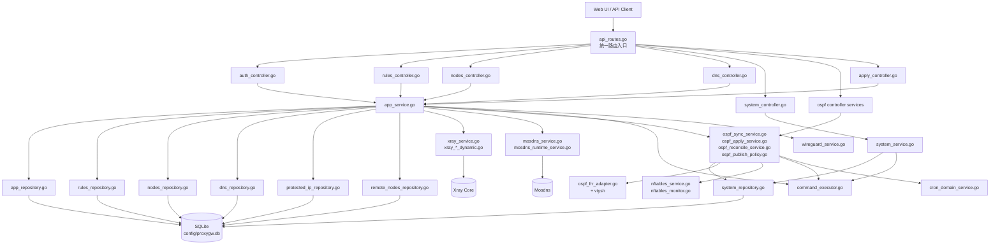

# ProxyGW 后端组件关系说明图

> 目标：给出 backend 关键组件的调用关系与数据流，便于后续重构时按层切分（Controller / Service / Repository / Runtime Adapter）。

## 1) 总体关系图（Mermaid）

## 2) 核心链路说明

### A. 规则变更链路
1. `rules_controller.go` 接收 `/api/rules` 请求
2. 进入 `app_service.go` 聚合流程
3. `rules_repository.go` 写入 SQLite
4. 根据模式触发：
   - Xray 动态路由更新（`xray_*_dynamic.go`）
   - Mosdns 域集更新（`mosdns_service.go`）
   - OSPF 候选/发布集合重算（`ospf_*_service.go`）

### B. 模式切换链路（A/B/C）
1. Controller 进入 `app_service.go` / `ospf_controller_service.go`
2. DB 持久化模式与相关设置
3. 按模式组合刷新 Xray / Mosdns / FRR / nftables
4. `ospf_reconcile_service.go` 负责发布集与 FRR 实际状态对齐

### C. 系统状态与运维链路
1. `system_controller.go` -> `system_service.go`
2. 聚合 DB 统计 + `command_executor.go` 系统命令输出
3. 返回仪表盘、事件日志、路由状态等视图

## 3) 分层重构建议（与现状兼容）

- Controller 保持“参数校验 + HTTP 编排”，不直接触碰运行时命令。
- Service 聚合业务事务（规则/模式/应用流程），统一调用 Runtime Adapter。
- Repository 只负责 SQL 与实体映射。
- Runtime Adapter（Xray/Mosdns/FRR/nftables）统一走 `command_executor.go`，便于门禁、审计和 dry-run。

---

如需可视化静态图（SVG/PNG），可将上面的 Mermaid 直接导入支持 Mermaid 的 Markdown 渲染器，或我可以再生成一份深色主题 HTML 架构图。