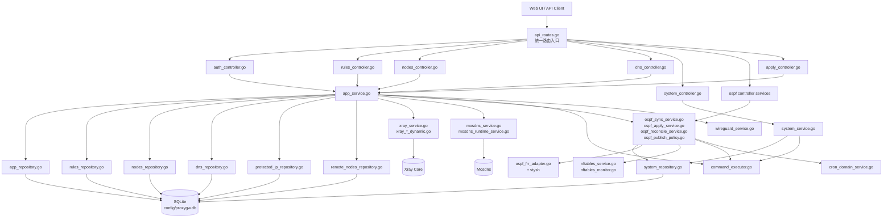
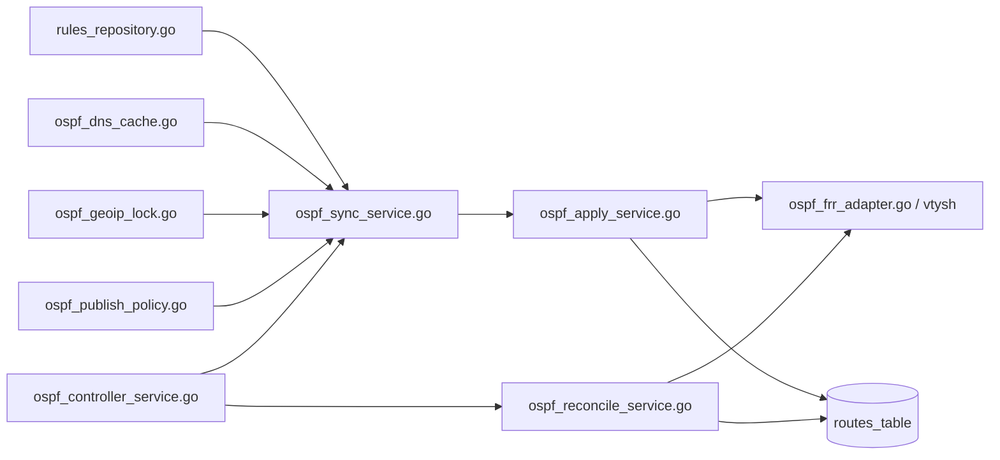
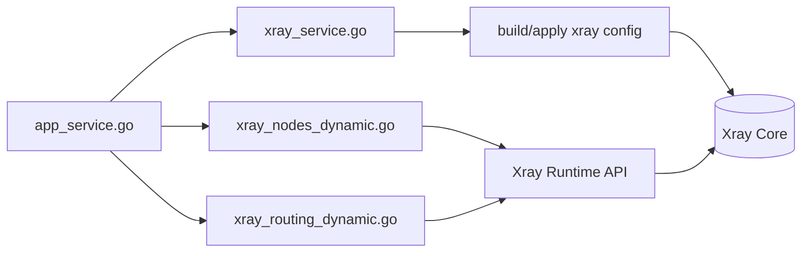
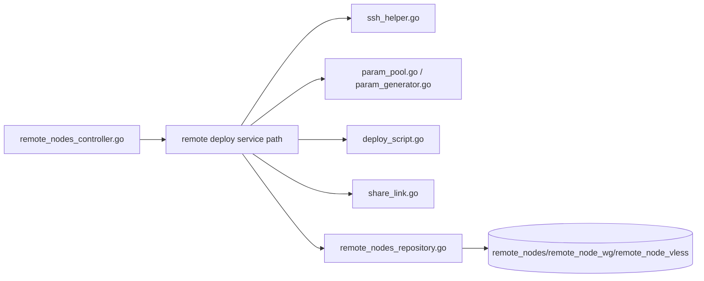

# ProxyGW 后端组件关系说明图

> 目标：给出 backend 关键组件的调用关系与数据流，便于后续重构时按层切分（Controller / Service / Repository / Runtime Adapter）。

## 1) 总体关系图（Mermaid）



## 2) 核心链路说明

### A. 规则变更链路
1. `rules_controller.go` 接收 `/api/rules` 请求
2. 进入 `app_service.go` 聚合流程
3. `rules_repository.go` 写入 SQLite
4. 根据模式触发：
   - Xray 动态路由更新（`xray_*_dynamic.go`）
   - Mosdns 域集更新（`mosdns_service.go`）
   - OSPF 候选/发布集合重算（`ospf_*_service.go`）

### B. 模式切换链路（A/B/C）
1. Controller 进入 `app_service.go` / `ospf_controller_service.go`
2. DB 持久化模式与相关设置
3. 按模式组合刷新 Xray / Mosdns / FRR / nftables
4. `ospf_reconcile_service.go` 负责发布集与 FRR 实际状态对齐

### C. 系统状态与运维链路
1. `system_controller.go` -> `system_service.go`
2. 聚合 DB 统计 + `command_executor.go` 系统命令输出
3. 返回仪表盘、事件日志、路由状态等视图

## 3) 二级展开图（文件级）

### 3.1 OSPF 子系统（`ospf_*`）



**职责划分**
- `ospf_sync_service.go`：构建候选路由集（domain/geosite/geoip/ip 规则收敛后的中间结果）。
- `ospf_apply_service.go`：把候选集应用到 FRR（增删路由 + 状态更新）。
- `ospf_reconcile_service.go`：周期对账，修正“DB 已发布但 FRR 未生效”等漂移。
- `ospf_publish_policy.go`：发布策略裁剪（如去重、覆盖裁剪、保护集排除）。
- `ospf_dns_cache.go` / `ospf_geoip_lock.go`：DNS 解析缓存与 geoip 锁定持久化。

### 3.2 Xray 子系统（`xray_*`）



**职责划分**
- `xray_service.go`：全量配置生成/落地/重载。
- `xray_nodes_dynamic.go`：节点级动态变更（增删改启停）优先走运行时 API。
- `xray_routing_dynamic.go`：规则级动态更新，失败回退到全量 apply。

### 3.3 远程部署子系统（`remote_deploy/*`）



**职责划分**
- `ssh_helper.go`：SSH 连接与远端执行（含主机指纹/认证流程）。
- `param_pool.go` / `param_generator.go`：端口、地址段、密钥参数分配与去冲突。
- `deploy_script.go`：远端安装/更新/卸载脚本拼装与执行。
- `share_link.go`：节点分享链接生成与回填。

### 3.4 实时连接追踪（`connection_tracker.go`）

```mermaid
flowchart LR
  Tracker[connection_tracker.go] --> RuleRepo[rules_repository.go]
  Tracker --> DNSCache[(domain_resolve_cache)]
  Tracker --> NodeRepo[nodes_repository.go]
  Tracker --> Event[event_logs.go]
  Tracker --> APIResp[/api/connections]
```

**说明**
- 当前热点之一是 `domain_resolve_cache.ips_json LIKE ...` 的反查路径，规模上来后会出现扫描成本。
- 后续建议演进为倒排映射表（`ip -> domain`）以替代 JSON LIKE。

## 4) 核心链路说明

### A. 规则变更链路
1. `rules_controller.go` 接收 `/api/rules` 请求
2. 进入 `app_service.go` 聚合流程
3. `rules_repository.go` 写入 SQLite
4. 根据模式触发：
   - Xray 动态路由更新（`xray_*_dynamic.go`）
   - Mosdns 域集更新（`mosdns_service.go`）
   - OSPF 候选/发布集合重算（`ospf_*_service.go`）

### B. 模式切换链路（A/B/C）
1. Controller 进入 `app_service.go` / `ospf_controller_service.go`
2. DB 持久化模式与相关设置
3. 按模式组合刷新 Xray / Mosdns / FRR / nftables
4. `ospf_reconcile_service.go` 负责发布集与 FRR 实际状态对齐

### C. 系统状态与运维链路
1. `system_controller.go` -> `system_service.go`
2. 聚合 DB 统计 + `command_executor.go` 系统命令输出
3. 返回仪表盘、事件日志、路由状态等视图

## 5) 分层重构建议（与现状兼容）

- Controller 保持“参数校验 + HTTP 编排”，不直接触碰运行时命令。
- Service 聚合业务事务（规则/模式/应用流程），统一调用 Runtime Adapter。
- Repository 只负责 SQL 与实体映射。
- Runtime Adapter（Xray/Mosdns/FRR/nftables）统一走 `command_executor.go`，便于门禁、审计和 dry-run。
- 对高频读路径（连接追踪、事件检索）优先做“可索引化数据结构”改造，避免逻辑正确但查询退化。

---

如需可视化静态图（SVG/PNG），可将上面的 Mermaid 直接导入支持 Mermaid 的 Markdown 渲染器，或我可以再生成一份深色主题 HTML 架构图。